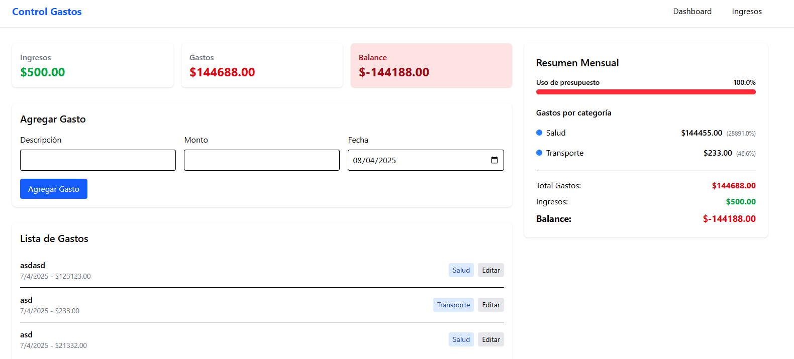

📊 Aplicación de Control de Gastos Personales

Aplicación web para gestionar finanzas personales, construida con Next.js, TypeScript y Tailwind CSS. Permite registrar gastos, categorizarlos, definir ingresos mensuales y visualizar balances.

🚀 Características Principales
Registro de gastos con descripción y monto

Categorización editable de gastos

Configuración de ingresos mensuales

Dashboard con resumen financiero

Persistencia de datos en localStorage

Interfaz responsive (móvil y desktop)

Falta agregar:

Edicion de gastos.
Eliminacion de gastos.
Ingreso de cuentas.
Control de gastos entre cuentas.
Diferentes monedas.
Visualizacion por fechas, categorias.
Metricas de gastos, balance, ingresos.
Agregado de PDF,CSV, con gastos, cuotas, resumen tarjeta.
Metodos de ahorro.
Aviso de limite de gastos.

-----------------------------------------------------------------------

🛠 Tecnologías Utilizadas
Tecnología	Uso
Next.js	Framework React
TypeScript	Tipado estático
Tailwind CSS	Estilos
React Hook Form	Manejo de formularios
Heroicons	Íconos

📂 Estructura del Proyecto

src/
├── app/                  # Rutas de la aplicación
│   ├── layout.tsx        # Layout principal
│   ├── page.tsx          # Página de dashboard
│   └── ingresos/         # Página de configuración
│       └── page.tsx
├── components/           # Componentes reutilizables
├── context/              # Estado global (Context API)
└── lib/                  # Utilidades y tipos

---------------------------------------------------------------------

⚙️ Instalación Local

1. Clonar el repositorio:
git clone https://github.com/tuusuario/control-gastos.git
cd control-gastos

2. Instalar dependencias:

npm install
# o
yarn install

3. Iniciar servidor de desarrollo:

npm run dev
# o
yarn dev

4. Abrir en el navegador:

http://localhost:3000

---------------------------------------------------------------------

Flujo de Datos:

Inicio:

El FinanceProvider carga los datos de localStorage.

La página principal (page.tsx) consume estos datos.

Agregar gasto:

ExpenseForm → Llama a addExpense del contexto → Actualiza estado y localStorage.

Editar categoría:

ExpenseList → Llama a updateExpense → Actualiza el gasto específico.

Configurar ingresos:

Página ingresos/page.tsx → Actualiza monthlyIncome en el contexto.

Diagrama de Componentes:

Layout
├── Navbar
└── Páginas
    ├── Dashboard (page.tsx)
    │   ├── Dashboard (resumen)
    │   ├── ExpenseForm
    │   ├── ExpenseList
    │   └── SummaryCard
    └── Ingresos (ingresos/page.tsx)

    Esta estructura asegura:
✅ Separación clara entre UI y lógica.
✅ Estado global accesible en toda la app.
✅ Persistencia de datos entre sesiones.
✅ Optimización con Server y Client Components.